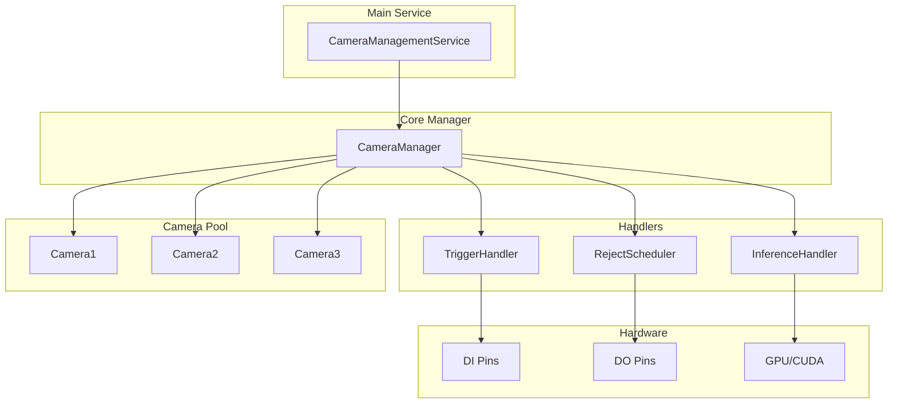
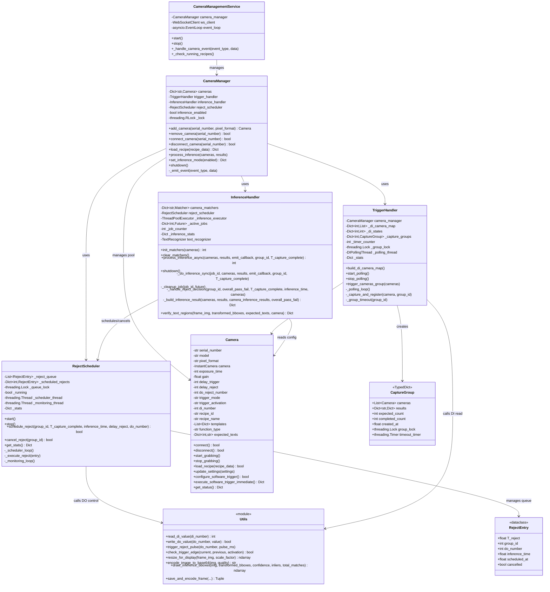
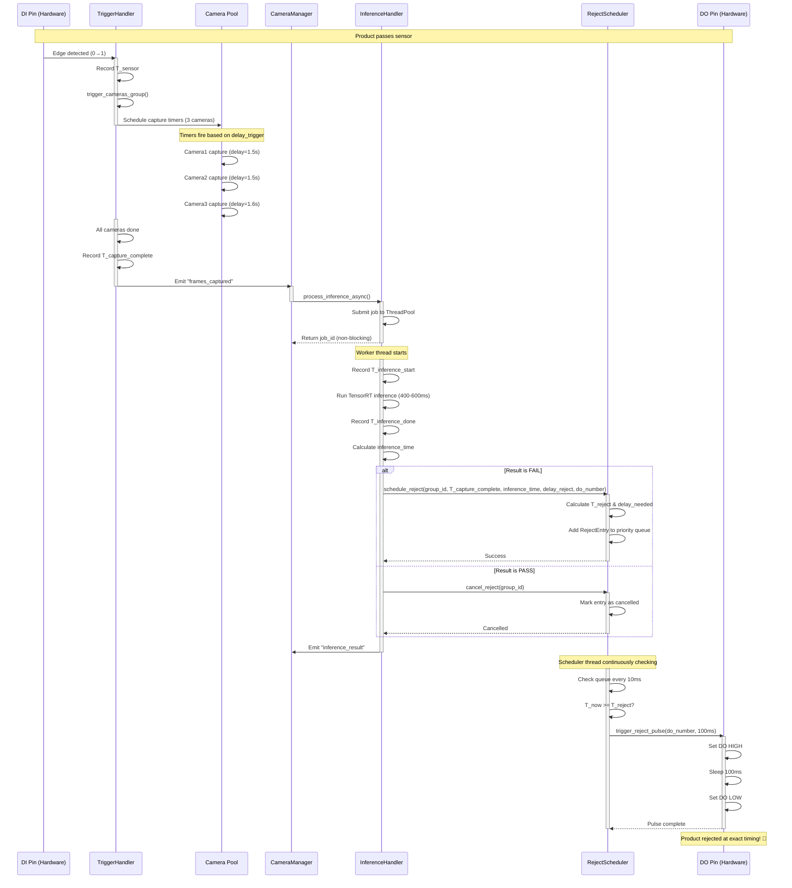
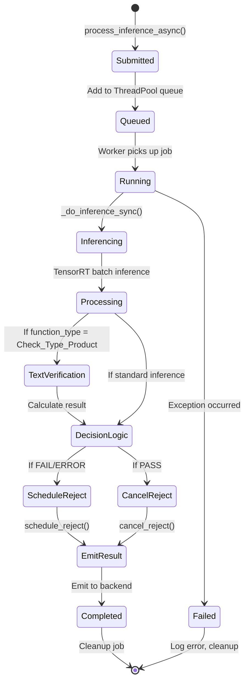
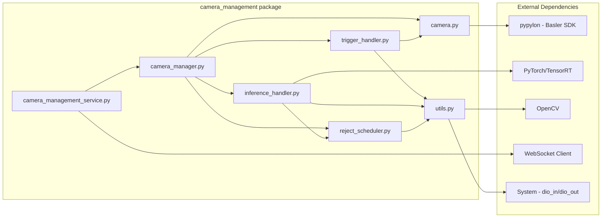
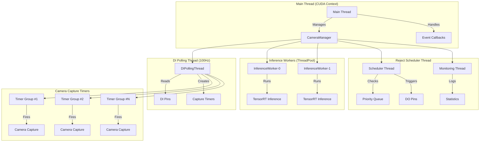
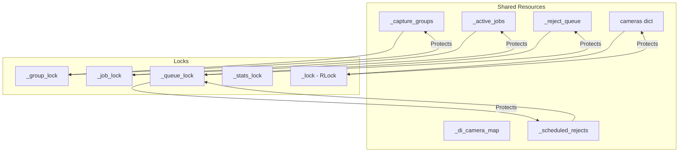
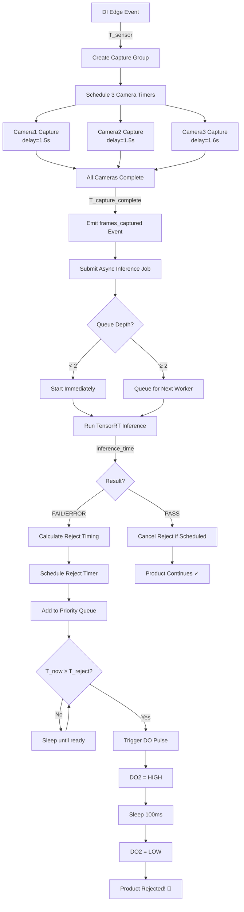

# Class Diagram - Camera Management System

## 🏗️ Architecture Overview



---

## 🔷 Detailed Class Diagram



---

## 📊 Sequence Diagram: Complete Flow



---

## 🔄 State Diagram: Inference Job Lifecycle



---

## 🔧 Component Interaction Matrix

| Component | Triggers | Inference | Reject | Camera | Utils |
|-----------|----------|-----------|--------|--------|-------|
| **TriggerHandler** | - | ✓ Emit event | - | ✓ Capture | ✓ DI read |
| **InferenceHandler** | - | - | ✓ Schedule/Cancel | ✓ Read config | - |
| **RejectScheduler** | - | - | - | - | ✓ DO write |
| **CameraManager** | ✓ Build map | ✓ Process | ✓ Init/Shutdown | ✓ Manage pool | - |
| **Camera** | ✓ Execute trigger | - | - | - | - |

---

## 📦 Module Dependencies



---

## 🎯 Threading Architecture



**Thread Summary:**
- **Main Thread (1):** Event loop, CUDA context, camera management
- **DI Polling Thread (1):** 100Hz polling, edge detection
- **Inference Workers (2):** Parallel inference execution
- **Reject Scheduler (1):** Priority queue checking, DO control
- **Reject Monitor (1):** Statistics logging
- **Capture Timers (N):** Dynamic, one per camera per trigger

**Total Threads:** 6 permanent + N dynamic (capture timers)

---

## 🔐 Thread Safety Mechanisms



**Lock Hierarchy:**
1. `CameraManager._lock` (RLock) - Highest level, camera pool operations
2. `TriggerHandler._group_lock` - Capture group operations
3. `InferenceHandler._job_lock` - Job tracking
4. `RejectScheduler._queue_lock` - Reject queue operations
5. Per-group locks - Individual capture group coordination

**No Deadlocks:** Locks are acquired in consistent order, released promptly.

---

## 📐 Data Flow Architecture



---

## 🎨 Design Patterns Used

### **1. Observer Pattern**
```
CameraManager (Subject)
    ↓ _emit_event()
CameraManagementService (Observer)
    ↓ _handle_camera_event()
```

### **2. Producer-Consumer Pattern**
```
TriggerHandler (Producer)
    → frames_captured events
InferenceHandler (Consumer)
    → processes events in ThreadPool
```

### **3. Priority Queue Pattern**
```
RejectScheduler
    → heapq-based priority queue
    → Sorted by T_reject (earliest first)
```

### **4. Thread Pool Pattern**
```
InferenceHandler
    → ThreadPoolExecutor (2 workers)
    → Async job submission
```

### **5. Strategy Pattern**
```
Camera.function_type
    → "OCR" strategy
    → "Check_Type_Product" strategy
    → "Default" strategy
```

---

## 📊 Memory Footprint Estimate

| Component | Memory Usage | Notes |
|-----------|--------------|-------|
| Camera (Pylon) | ~50MB each | 3 cameras = 150MB |
| TensorRT Engine | ~200MB | Shared across jobs |
| Frame Buffers | ~10MB each | 3 cameras × N frames |
| Text Recognizer | ~100MB | ONNX model |
| ThreadPool | ~20MB | 2 workers |
| Reject Queue | ~1KB | Minimal overhead |
| **Total Estimate** | **~500-600MB** | Under normal load |

---

## 🔍 Key Metrics

| Metric | Value | Target |
|--------|-------|--------|
| DI Polling Rate | 100Hz | ±10% |
| Inference Latency | 400-600ms | <800ms |
| Reject Timing Accuracy | ±50ms | ±100ms acceptable |
| Throughput | 10 products/min | Scalable to 20+ |
| Memory Usage | 500-600MB | <1GB |
| CPU Usage | 20-40% | <60% |
| GPU Usage | 30-50% | <80% |

---

## ⚠️ Critical Issue Discovered

### **🐛 BUG: Incorrect Reject Timing Calculation**

**Current Implementation (WRONG):**
```python
# In reject_scheduler.py:
T_reject = T_capture_complete + (delay_reject / 1000.0)
```

**Issue:**
- `delay_reject` is measured from **SENSOR** to reject station
- NOT from camera to reject station!
- Products arrive at reject BEFORE reject pulse fires

**Correct Implementation:**
```python
# Should be:
T_reject = T_sensor + (delay_reject / 1000.0)
delay_needed = T_reject - T_inference_done
```

**Impact:**
- Products pass reject station before DO pulse
- 100% reject miss rate!

**Fix Required:**
1. Track `T_sensor` in `TriggerHandler.trigger_cameras_group()`
2. Pass `T_sensor` through event chain
3. Update `RejectScheduler.schedule_reject()` to use `T_sensor`

---

**Document Version:** 1.0
**Last Updated:** 2026-01-12
**Diagrams Generated:** Mermaid.js compatible
