# Class Diagram - Camera Management System (Refactored)

## 🏗️ Architecture Overview

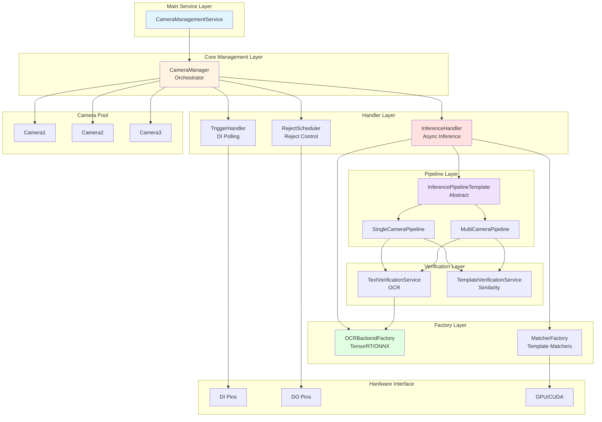

---

## 🔷 Complete Class Diagram

```mermaid
classDiagram
    %% ==================== SERVICE LAYER ====================

    class CameraManagementService {
        -CameraManager camera_manager
        -WebSocketClient ws_client
        -asyncio.EventLoop event_loop
        +start()
        +stop()
        -_handle_camera_event(event_type, data)
        -_check_running_recipes()
    }

    %% ==================== CORE MANAGER ====================

    class CameraManager {
        -Dict~str,Camera~ cameras
        -TriggerHandler trigger_handler
        -InferenceHandler inference_handler
        -RejectScheduler reject_scheduler
        -bool inference_enabled
        -threading.RLock _lock
        +add_camera(serial_number, pixel_format) Camera
        +remove_camera(serial_number) bool
        +connect_camera(serial_number) bool
        +disconnect_camera(serial_number) bool
        +load_recipe(recipe_data) Dict
        +stop_recipe() Dict
        +process_inference(cameras, results)
        +set_inference_mode(enabled) Dict
        +shutdown()
        -_emit_event(event_type, data)
    }

    %% ==================== CAMERA ====================

    class Camera {
        -str serial_number
        -str model
        -str pixel_format
        -InstantCamera camera
        -CameraMode mode
        -int exposure_time
        -float gain
        -int delay_trigger
        -int delay_reject
        -int do_reject_number
        -str trigger_mode
        -str trigger_activation
        -int di_number
        -str recipe_id
        -str recipe_name
        -List~Dict~ templates
        -str function_type
        -Dict~int,Dict~ expected_texts
        +connect() bool
        +disconnect() bool
        +start_grabbing()
        +stop_grabbing()
        +load_recipe(recipe_data) bool
        +update_settings(settings)
        +set_mode(mode)
        +configure_software_trigger() bool
        +execute_software_trigger_immediate() Dict
        +get_status() Dict
    }

    class CameraMode {
        <<enumeration>>
        IDLE
        CONTINUOUS
        SOFTWARE_TRIGGER
    }

    %% ==================== TRIGGER HANDLER ====================

    class TriggerHandler {
        -CameraManager camera_manager
        -Dict~int,List~ _di_camera_map
        -Dict~int,int~ _di_states
        -Dict~int,CaptureGroup~ _capture_groups
        -int _group_counter
        -threading.Lock _group_lock
        -List~Timer~ _active_timers
        -threading.Thread _polling_thread
        -Dict _stats
        +build_di_camera_map()
        +start_polling()
        +stop_polling()
        +trigger_cameras_group(cameras)
        +get_stats() Dict
        -_polling_loop()
        -_capture_and_register(camera, group_id)
        -_group_timeout(group_id)
    }

    class CaptureGroup {
        <<TypedDict>>
        +List~Camera~ cameras
        +Dict~str,Dict~ results
        +int expected_count
        +int completed_count
        +float created_at
        +threading.Timer timeout_timer
    }

    %% ==================== INFERENCE HANDLER ====================

    class InferenceHandler {
        -Dict~str,Union~ camera_matchers
        -RejectScheduler reject_scheduler
        -ThreadPoolExecutor _inference_executor
        -Dict~int,Future~ _active_jobs
        -int _job_counter
        -threading.Lock _job_lock
        -Dict _inference_stats
        -OCRBackendStrategy text_recognizer
        -TextVerificationService text_verification_service
        -TemplateVerificationService template_verification_service
        -MatcherFactory matcher_factory
        +init_matchers(cameras) int
        +clear_matchers()
        +process_inference_async(cameras, results, emit_callback, group_id, T_capture_complete) int
        +shutdown()
        -_do_inference_sync(job_id, cameras, results, emit_callback, group_id, T_capture_complete)
        -_cleanup_job(job_id, future)
        -_handle_reject_decision(group_id, overall_pass_fail, T_capture_complete, inference_time, cameras)
    }

    %% ==================== OCR STRATEGY PATTERN ====================

    class OCRBackendStrategy {
        <<abstract>>
        +backend_name() str*
        +is_available() bool*
        +recognize(image, return_confidence) Tuple~str,float~*
        +recognize_batch(images) List~Tuple~*
    }

    class TensorRTOCRBackend {
        -TextRecognizerTRT _recognizer
        -OCRConfig _config
        +backend_name() str
        +is_available() bool
        +recognize(image, return_confidence) Tuple~str,float~
        +recognize_batch(images) List~Tuple~
    }

    class ONNXOCRBackend {
        -TextRecognizer _recognizer
        -OCRConfig _config
        +backend_name() str
        +is_available() bool
        +recognize(image, return_confidence) Tuple~str,float~
        +recognize_batch(images) List~Tuple~
    }

    class OCRBackendFactory {
        <<factory>>
        +create(backend_type, config) OCRBackendStrategy$
        +create_from_env() OCRBackendStrategy$
        +check_availability() Dict$
        -_create_tensorrt_backend(config) TensorRTOCRBackend$
        -_create_onnx_backend(config) ONNXOCRBackend$
    }

    class OCRBackendType {
        <<enumeration>>
        TENSORRT
        ONNX
        AUTO
    }

    class OCRConfig {
        <<dataclass>>
        +str engine_path
        +str onnx_path
        +str dict_path
        +int height
        +int width
    }

    %% ==================== MATCHER FACTORY ====================

    class MatcherFactory {
        -str engine_path
        -Path temp_dir
        -Path backend_dir
        -type _matcher_class
        +create_matcher(camera, template_data, template_idx, verbose) SuperPointMatcher
        +create_matchers_for_camera(camera, verbose_first) List~SuperPointMatcher~
        -_copy_template_file(template_path, dest_dir) Path
        -_parse_template_annotations(template_data) Tuple
        -_apply_crop_to_template(template_img, crop_area) ndarray
        -_create_annotation_json(template_path, annotations, crop_area)
    }

    class MatcherConfig {
        <<dataclass>>
        +str template_path
        +str annotation_path
        +int template_idx
        +CropArea crop_area
        +float similarity_threshold
    }

    class CropArea {
        <<dataclass>>
        +int x
        +int y
        +int width
        +int height
        +to_dict() Dict
        +from_dict(data) CropArea$
    }

    class BoundingBox {
        <<dataclass>>
        +int x1
        +int y1
        +int x2
        +int y2
        +to_dict() Dict
        +from_dict(data) BoundingBox$
    }

    class AnnotationParser {
        <<static>>
        +parse_annotations(template_data) List~Dict~$
        +get_template_bbox(annotations) BoundingBox$
        +get_text_regions(annotations) List~Dict~$
        +get_crop_area(template_data) CropArea$
    }

    %% ==================== PIPELINE PATTERN ====================

    class InferencePipelineTemplate {
        <<abstract>>
        +process(context) Dict*
        #prepare(context) bool*
        #preprocess(context) Dict*
        #run_inference(context, preprocessed) Dict*
        #verify_results(context, inference_results) Tuple*
        #postprocess(context, verification_results) Dict*
        #finalize(context, final_result) Dict*
        -_log_stage(stage_name, message)
    }

    class PipelineContext {
        <<dataclass>>
        +int job_id
        +List~Camera~ cameras
        +Dict~str,Dict~ results
        +Dict camera_matchers
        +int group_id
        +float T_capture_complete
        +Callable emit_callback
        +TextVerificationService text_verification_service
        +TemplateVerificationService template_verification_service
        +OCRBackendStrategy text_recognizer
        +List~Camera~ cameras_to_process
        +Dict camera_inference_results
    }

    class SingleCameraPipeline {
        +process(context) Dict
        #prepare(context) bool
        #preprocess(context) Dict
        #run_inference(context, preprocessed) Dict
        #verify_results(context, inference_results) Tuple
        #postprocess(context, verification_results) Dict
        #finalize(context, final_result) Dict
        -_process_single_template(context, camera, matcher, frames)
        -_process_multi_templates(context, camera, matchers, frames)
    }

    class MultiCameraPipeline {
        +process(context) Dict
        #prepare(context) bool
        #preprocess(context) Dict
        #run_inference(context, preprocessed) Dict
        #verify_results(context, inference_results) Tuple
        #postprocess(context, verification_results) Dict
        #finalize(context, final_result) Dict
    }

    %% ==================== VERIFICATION SERVICES ====================

    class TextVerificationService {
        -OCRBackendStrategy ocr_backend
        +verify_text_regions(frame_img, transformed_bboxes, expected_texts, camera) Dict
        +batch_verify_multi_camera(ocr_tasks) Dict
        -_crop_text_region(frame_img, bbox) ndarray
        -_compare_texts(recognized, expected) bool
    }

    class TemplateVerificationService {
        +verify_template_regions(frame_img, template_img, transformed_bboxes, camera, matcher) Dict
        -_extract_template_region(frame_img, bbox) ndarray
        -_calculate_similarity(region1, region2, method) float
    }

    %% ==================== RESULT BUILDER ====================

    class InferenceResultBuilder {
        <<static>>
        +from_cameras(cameras, camera_inference_results, overall_pass_fail, group_id, recipe_id, recipe_name) Dict$
        +from_single_camera(camera, inference_result, overall_pass_fail, group_id, recipe_id, recipe_name) Dict$
        -_build_camera_result(camera, result) Dict$
    }

    %% ==================== REJECT SCHEDULER ====================

    class RejectScheduler {
        -List~RejectEntry~ _reject_queue
        -Dict~int,RejectEntry~ _scheduled_rejects
        -threading.Lock _queue_lock
        -bool _running
        -threading.Thread _scheduler_thread
        -threading.Thread _monitoring_thread
        -Dict _stats
        +start()
        +stop()
        +schedule_reject(group_id, T_capture_complete, inference_time, delay_reject, do_number) bool
        +cancel_reject(group_id) bool
        +get_stats() Dict
        -_scheduler_loop()
        -_execute_reject(entry)
        -_monitoring_loop()
    }

    class RejectEntry {
        <<dataclass>>
        +float T_reject
        +int group_id
        +int do_number
        +float inference_time
        +float scheduled_at
        +bool cancelled
    }

    %% ==================== UTILITIES ====================

    class Utils {
        <<module>>
        +read_di_value(di_number) int$
        +write_do_value(do_number, value) bool$
        +trigger_reject_pulse(do_number, pulse_ms)$
        +check_trigger_edge(current, previous, activation) bool$
        +resize_for_display(frame_img, scale_factor) ndarray$
        +encode_image_to_base64(img, quality) str$
        +draw_inference_bboxes(img, transformed_bboxes, confidence, inliers, total_matches) ndarray$
        +save_and_encode_frame(...) Tuple$
    }

    %% ==================== RELATIONSHIPS ====================

    %% Service layer
    CameraManagementService --> CameraManager : manages

    %% Core manager relationships
    CameraManager --> TriggerHandler : delegates trigger
    CameraManager --> InferenceHandler : delegates inference
    CameraManager --> RejectScheduler : manages reject
    CameraManager --> Camera : manages pool

    %% Camera relationships
    Camera --> CameraMode : has mode

    %% Trigger handler relationships
    TriggerHandler --> Camera : triggers
    TriggerHandler --> CaptureGroup : creates
    TriggerHandler --> Utils : uses DI read

    %% Inference handler relationships
    InferenceHandler --> RejectScheduler : schedules/cancels
    InferenceHandler --> OCRBackendFactory : creates backend
    InferenceHandler --> MatcherFactory : creates matchers
    InferenceHandler --> InferencePipelineTemplate : selects pipeline
    InferenceHandler --> TextVerificationService : uses
    InferenceHandler --> TemplateVerificationService : uses

    %% OCR strategy relationships
    OCRBackendStrategy <|-- TensorRTOCRBackend : implements
    OCRBackendStrategy <|-- ONNXOCRBackend : implements
    OCRBackendFactory --> OCRBackendStrategy : creates
    OCRBackendFactory --> TensorRTOCRBackend : creates
    OCRBackendFactory --> ONNXOCRBackend : creates
    OCRBackendFactory --> OCRConfig : uses
    OCRBackendFactory --> OCRBackendType : uses

    %% Matcher factory relationships
    MatcherFactory --> MatcherConfig : creates
    MatcherFactory --> CropArea : uses
    MatcherFactory --> BoundingBox : uses
    MatcherFactory --> AnnotationParser : uses

    %% Pipeline relationships
    InferencePipelineTemplate <|-- SingleCameraPipeline : implements
    InferencePipelineTemplate <|-- MultiCameraPipeline : implements
    InferencePipelineTemplate --> PipelineContext : uses
    SingleCameraPipeline --> TextVerificationService : uses
    SingleCameraPipeline --> TemplateVerificationService : uses
    SingleCameraPipeline --> InferenceResultBuilder : uses
    MultiCameraPipeline --> TextVerificationService : uses
    MultiCameraPipeline --> TemplateVerificationService : uses
    MultiCameraPipeline --> InferenceResultBuilder : uses

    %% Verification relationships
    TextVerificationService --> OCRBackendStrategy : uses
    TemplateVerificationService --> Camera : reads config

    %% Reject scheduler relationships
    RejectScheduler --> RejectEntry : manages queue
    RejectScheduler --> Utils : uses DO control
```

---

## 📊 Enhanced Sequence Diagram: Complete Flow with Refactored Components

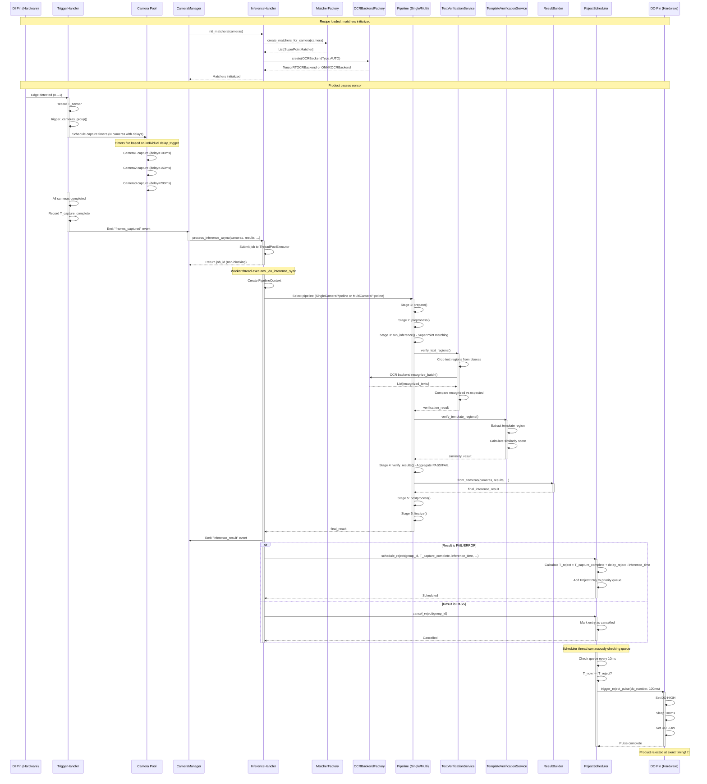

---

## 🔄 Pipeline State Diagram

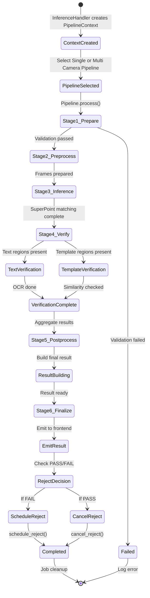

---

## 🎨 Design Patterns Overview

### **1. Factory Pattern**

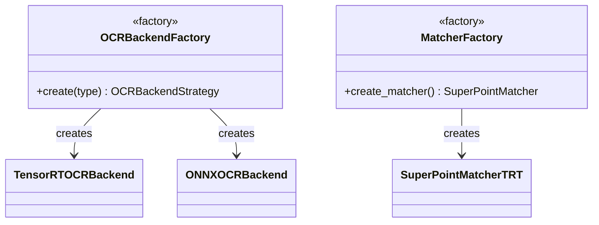

**Purpose:** Create complex objects with conditional logic
**Benefits:**
- Centralized creation logic
- Easy to add new backends/matchers
- Runtime backend selection (TensorRT vs ONNX)

---

### **2. Strategy Pattern**

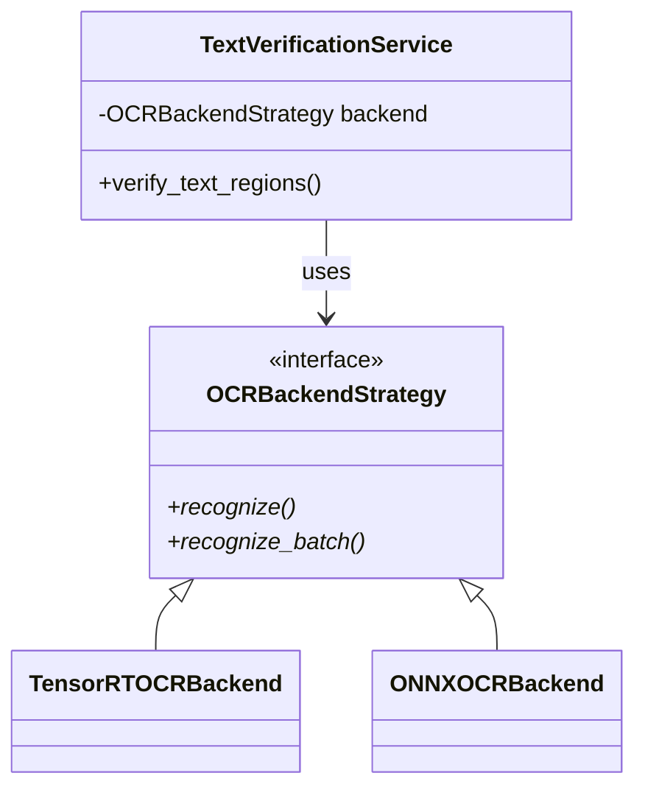

**Purpose:** Swap OCR implementations at runtime
**Benefits:**
- Flexible backend selection
- Easy to test with mocks
- Performance optimization (TensorRT) vs compatibility (ONNX)

---

### **3. Template Method Pattern**

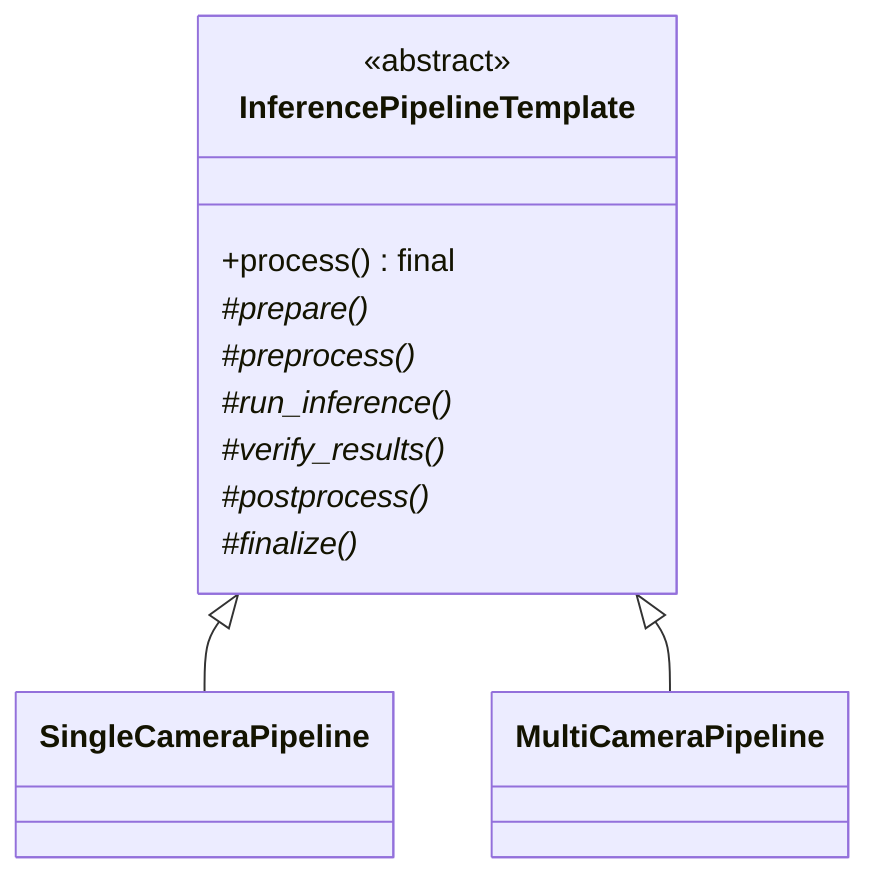

**Purpose:** Define inference pipeline skeleton, subclasses implement stages
**Benefits:**
- Consistent 6-stage pipeline
- Single and multi-camera implementations share structure
- Easy to add new pipeline types

**6 Stages:**
1. **prepare()** - Validate inputs, filter cameras
2. **preprocess()** - Prepare frames for inference
3. **run_inference()** - Execute SuperPoint matching
4. **verify_results()** - Text & template verification
5. **postprocess()** - Build final results
6. **finalize()** - Emit results, schedule rejects

---

### **4. Builder Pattern**

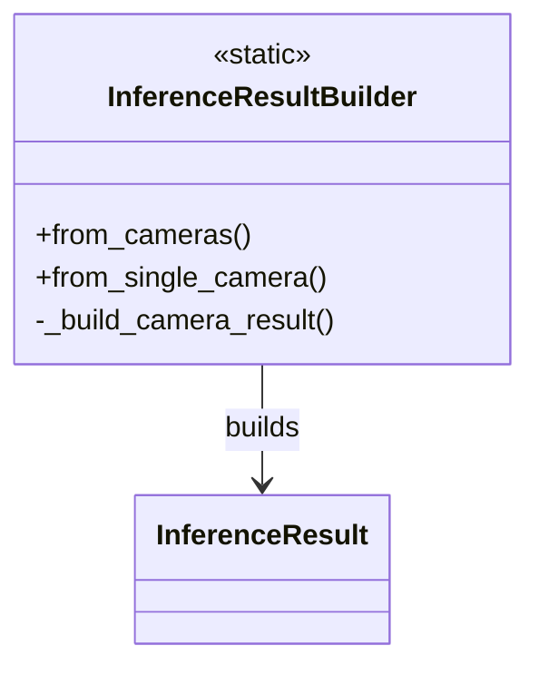

**Purpose:** Construct complex inference result objects
**Benefits:**
- Consistent result structure
- Separation of result building logic
- Easy to extend with new fields

---

### **5. Handler Pattern**

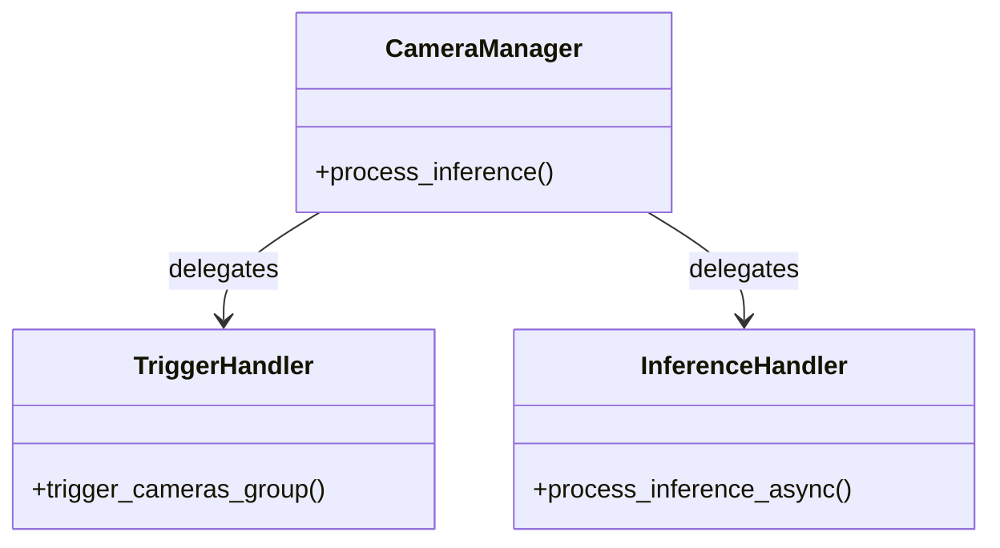

**Purpose:** Delegate specific responsibilities
**Benefits:**
- Separation of concerns
- Single responsibility principle
- Easier to test and maintain

---

## 📦 Module Dependencies (Refactored)

```mermaid
graph TB
    subgraph "camera_management package"
        CMS[camera_management_service.py]
        CM[camera_manager.py]
        CAM[camera.py]
        TH[trigger_handler.py]
        IH[inference_handler.py]
        RS[reject_scheduler.py]
        UTIL[utils.py]

        subgraph "ocr subpackage"
            OCR_BASE[ocr/base.py]
            OCR_FACT[ocr/factory.py]
        end

        subgraph "matchers subpackage"
            MATCH_FACT[matchers/factory.py]
            MATCH_CONF[matchers/config.py]
            MATCH_ANN[matchers/annotation_parser.py]
        end

        subgraph "pipeline subpackage"
            PIPE_BASE[pipeline/base.py]
            PIPE_SINGLE[pipeline/single_camera.py]
            PIPE_MULTI[pipeline/multi_camera.py]
        end

        subgraph "verification subpackage"
            VERIF_TEXT[verification/text_verifier.py]
            VERIF_TEMP[verification/template_verifier.py]
        end

        subgraph "result_builder subpackage"
            RB[result_builder/builder.py]
        end
    end

    subgraph "External Dependencies"
        PYLON[pypylon - Basler SDK]
        TORCH[PyTorch/TensorRT]
        CV2[OpenCV]
        WS[WebSocket Client]
        SYS[System - dio_in/dio_out]
        INF_ENG[inference_engine_shared]
        INF_SVC[inference_service]
    end

    %% Service dependencies
    CMS --> CM
    CMS --> WS

    %% Manager dependencies
    CM --> TH
    CM --> IH
    CM --> RS
    CM --> CAM

    %% Handler dependencies
    TH --> CAM
    TH --> UTIL
    IH --> RS
    IH --> OCR_FACT
    IH --> MATCH_FACT
    IH --> PIPE_BASE
    IH --> VERIF_TEXT
    IH --> VERIF_TEMP

    %% OCR dependencies
    OCR_FACT --> OCR_BASE
    OCR_FACT --> INF_ENG
    OCR_FACT --> INF_SVC

    %% Matcher dependencies
    MATCH_FACT --> MATCH_CONF
    MATCH_FACT --> MATCH_ANN
    MATCH_FACT --> INF_ENG
    MATCH_FACT --> INF_SVC

    %% Pipeline dependencies
    PIPE_SINGLE --> PIPE_BASE
    PIPE_MULTI --> PIPE_BASE
    PIPE_SINGLE --> VERIF_TEXT
    PIPE_SINGLE --> VERIF_TEMP
    PIPE_SINGLE --> RB
    PIPE_MULTI --> VERIF_TEXT
    PIPE_MULTI --> VERIF_TEMP
    PIPE_MULTI --> RB

    %% Verification dependencies
    VERIF_TEXT --> OCR_BASE
    VERIF_TEMP --> CV2

    %% Utility dependencies
    RS --> UTIL
    UTIL --> CV2
    UTIL --> SYS

    %% Camera dependencies
    CAM --> PYLON

    %% External dependencies
    OCR_BASE --> TORCH

    style CMS fill:#e1f5ff
    style CM fill:#fff4e1
    style IH fill:#ffe1e1
    style OCR_FACT fill:#e1ffe1
    style PIPE_BASE fill:#f0e1ff
```

---

## 🎯 Threading Architecture (Updated)

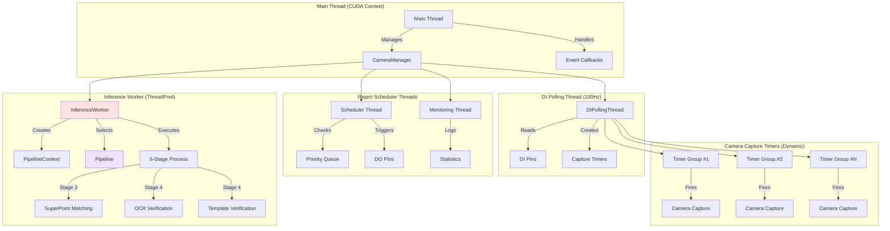

**Thread Summary:**

- **Main Thread (1):** Event loop, CUDA context, camera management
- **DI Polling Thread (1):** 100Hz polling, edge detection, timer scheduling
- **Inference Worker (1):** Pipeline execution (Single/Multi), verification
- **Reject Scheduler (1):** Priority queue checking, DO control
- **Reject Monitor (1):** Statistics logging
- **Capture Timers (N):** Dynamic, one per camera per trigger group

**Total Threads:** 5 permanent + N dynamic (capture timers)

---

## 🔐 Thread Safety Mechanisms

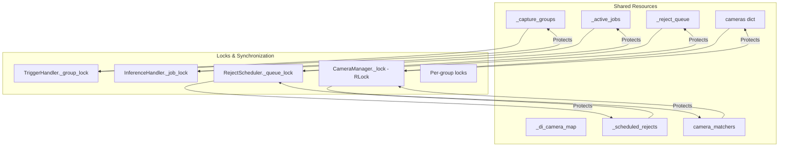

**Lock Hierarchy (to prevent deadlocks):**

1. `CameraManager._lock` (RLock) - Highest level, camera pool & matchers
2. `TriggerHandler._group_lock` - Capture group operations
3. `InferenceHandler._job_lock` - Job tracking
4. `RejectScheduler._queue_lock` - Reject queue operations
5. Per-group locks - Individual capture group coordination

---

## 📐 Data Flow Architecture (Refactored)

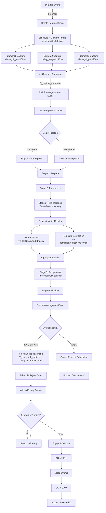

---

## 🔍 Component Interaction Matrix (Updated)

| Component | Triggers | Inference | Reject | Camera | Factories | Pipeline | Verification | Utils |
|-----------|----------|-----------|--------|--------|-----------|----------|--------------|-------|
| **CameraManager** | ✓ Build map | ✓ Delegate | ✓ Init/Stop | ✓ Manage | - | - | - | - |
| **TriggerHandler** | - | ✓ Emit event | - | ✓ Capture | - | - | - | ✓ DI read |
| **InferenceHandler** | - | - | ✓ Schedule/Cancel | ✓ Read config | ✓ Create | ✓ Select | ✓ Init services | - |
| **SingleCameraPipeline** | - | ✓ Execute | - | ✓ Read templates | - | - | ✓ Use services | - |
| **MultiCameraPipeline** | - | ✓ Execute | - | ✓ Read templates | - | - | ✓ Use services | - |
| **TextVerificationService** | - | ✓ OCR | - | ✓ Read expected_texts | ✓ Use OCR backend | - | - | - |
| **TemplateVerificationService** | - | ✓ Verify | - | ✓ Read threshold | - | - | - | ✓ Similarity calc |
| **RejectScheduler** | - | - | - | - | - | - | - | ✓ DO write |
| **OCRBackendFactory** | - | ✓ Provide backend | - | - | - | - | - | - |
| **MatcherFactory** | - | ✓ Create matchers | - | ✓ Read templates | - | - | - | ✓ Image crop |

---

## 📊 Key Metrics

| Metric | Value | Target | Notes |
|--------|-------|--------|-------|
| DI Polling Rate | 100Hz | ±10% | Consistent edge detection |
| SuperPoint Inference | 100-200ms | <300ms | Per camera |
| OCR Recognition (batch) | 50-100ms | <150ms | TensorRT backend |
| Total Inference Latency | 400-600ms | <800ms | Including verification |
| Reject Timing Accuracy | ±50ms | ±100ms acceptable | Hardware + queue delay |
| Throughput | 10 products/min | Scalable to 20+ | Multi-camera support |
| Memory Usage | 600-800MB | <1GB | With TensorRT engines |
| CPU Usage | 20-40% | <60% | Polling + workers |
| GPU Usage | 30-50% | <80% | TensorRT inference |
| Pipeline Overhead | <20ms | <50ms | Context + stage transitions |

---

## 🆕 Refactoring Benefits

### **Before Refactoring:**
❌ Monolithic `InferenceHandler` with 1000+ lines
❌ Hardcoded inference logic
❌ No separation between OCR backends
❌ Difficult to test individual stages
❌ Hard to add new camera configurations

### **After Refactoring:**
✅ **Factory Pattern** - Easy to add new OCR backends (e.g., PaddleOCR)
✅ **Strategy Pattern** - Runtime backend selection (TensorRT/ONNX)
✅ **Template Method Pattern** - Clear 6-stage pipeline
✅ **Single Responsibility** - Each class has one job
✅ **Testability** - Mock services, test stages independently
✅ **Extensibility** - Add new pipelines (e.g., TripleCameraPipeline)
✅ **Maintainability** - Small, focused modules
✅ **Performance** - Batch OCR, optimized matchers

---

## 📚 Key Files Reference

| File Path | Key Classes | Purpose | Lines |
|-----------|-------------|---------|-------|
| `camera_manager.py` | CameraManager | Orchestration, event management | ~500 |
| `camera.py` | Camera, CameraMode | Single camera control, trigger execution | ~600 |
| `trigger_handler.py` | TriggerHandler, CaptureGroup | DI polling, group management, timing | ~450 |
| `inference_handler.py` | InferenceHandler | Async inference coordination | ~400 |
| `ocr/base.py` | OCRBackendStrategy | OCR abstract interface | ~50 |
| `ocr/factory.py` | OCRBackendFactory, TensorRTOCRBackend, ONNXOCRBackend | OCR backend creation | ~200 |
| `matchers/factory.py` | MatcherFactory | Template matcher creation | ~300 |
| `matchers/config.py` | MatcherConfig, CropArea, BoundingBox | Configuration dataclasses | ~100 |
| `matchers/annotation_parser.py` | AnnotationParser | Parse template annotations | ~150 |
| `pipeline/base.py` | InferencePipelineTemplate, PipelineContext | Pipeline abstract pattern | ~150 |
| `pipeline/single_camera.py` | SingleCameraPipeline | Single camera pipeline | ~300 |
| `pipeline/multi_camera.py` | MultiCameraPipeline | Multi camera pipeline | ~250 |
| `verification/text_verifier.py` | TextVerificationService | OCR text verification | ~200 |
| `verification/template_verifier.py` | TemplateVerificationService | Template similarity verification | ~150 |
| `result_builder/builder.py` | InferenceResultBuilder | Result construction | ~150 |
| `reject_scheduler.py` | RejectScheduler, RejectEntry | Reject timing and control | ~350 |
| `utils.py` | Utils | Hardware interface, image utilities | ~400 |

**Total Refactored LOC:** ~4,600 (was ~3,500 in monolithic version)
**Benefit:** Better structure, easier maintenance despite more lines

---

## 🔧 Configuration Flow

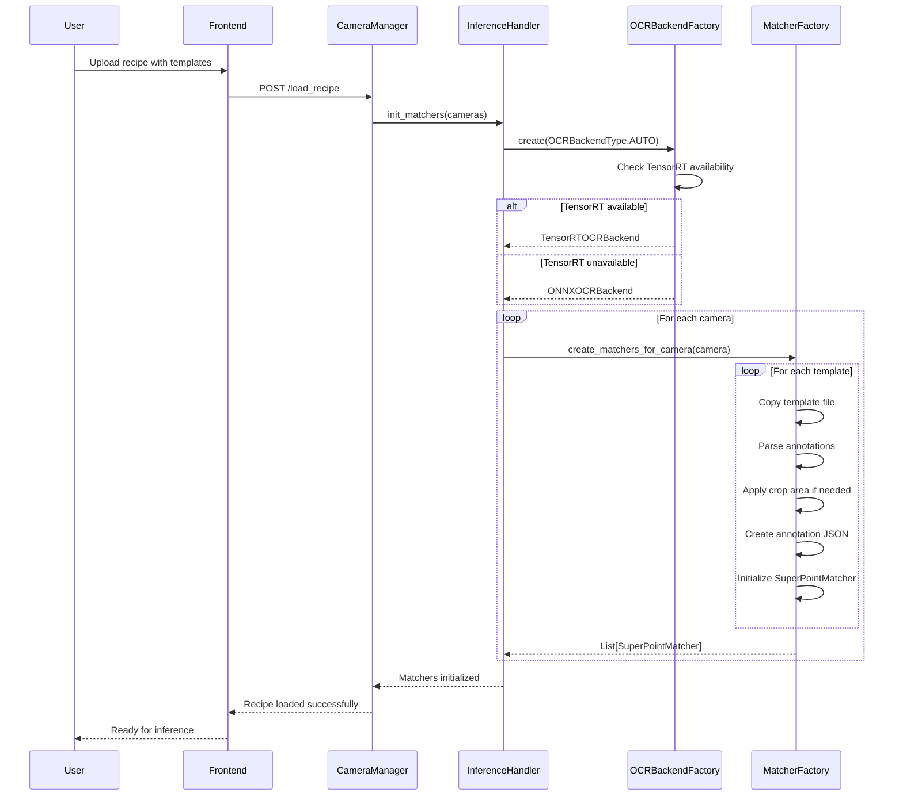

---

**Document Version:** 2.0 (Refactored)
**Last Updated:** 2026-01-26
**Refactoring Date:** 2026-01-12
**Architecture:** Factory + Strategy + Template Method + Handler Patterns
**Diagrams:** Mermaid.js compatible
